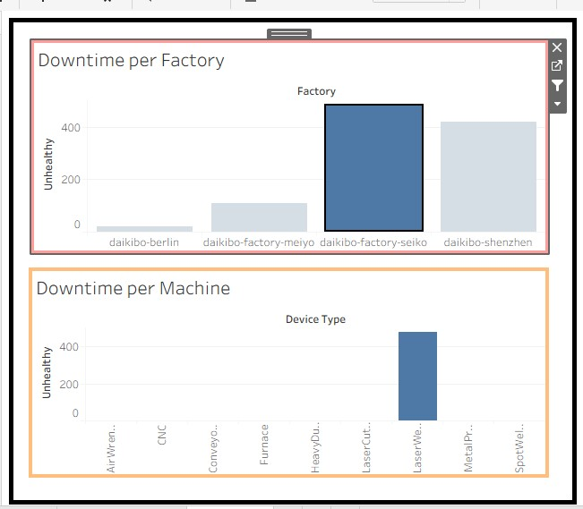
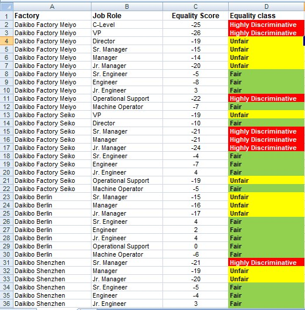
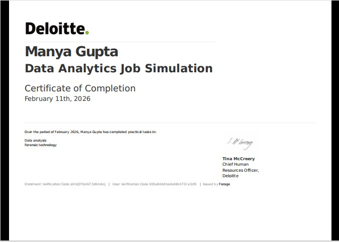

# Deloitte Australia Data Analytics Job Simulation – Forage  

---

## 📌 Project Overview  

Completed a Deloitte Australia job simulation involving data analysis and forensic technology.  
The project focused on analyzing structured datasets, identifying trends, and generating business insights through classification and dashboard visualization techniques.

---

## 📊 Key Responsibilities  

- Performed data analysis within a forensic technology case scenario  
- Classified and structured datasets using Microsoft Excel  
- Identified patterns and anomalies to support business conclusions  
- Developed an interactive dashboard using Tableau  

---

## 🛠 Tools & Technologies Used  

- Tableau (Dashboard Development)  
- Microsoft Excel (Data Classification & Analysis)  
- Data Visualization  
- Business Insight Generation  

---

## 📈 Dashboard Output  

### 🏢 Company Analysis View  

---

### 📊 Equality Table Analysis  

---

## 💡 Skills Demonstrated  

- Data Cleaning & Classification  
- Analytical Thinking  
- Dashboard Development  
- Business Problem Solving  
- Insight Communication  

---
## 🏆 Completion Certificate  

---
